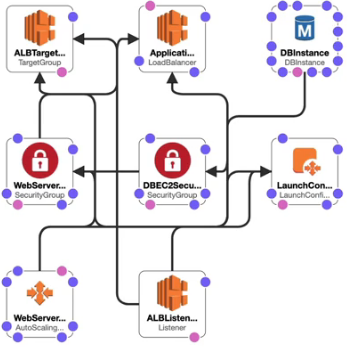
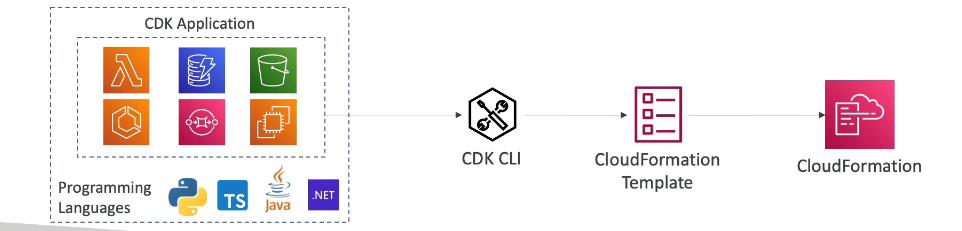
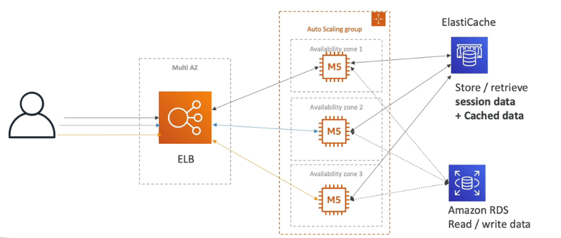
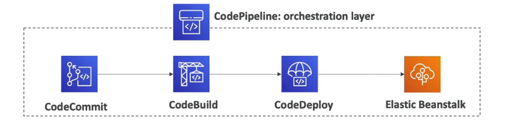
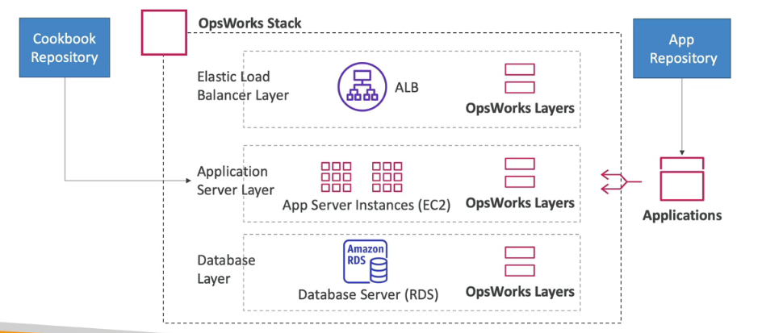

# Deployments & Managing Infrastructure at scale
## CloudFormation

Infrastructure as code
- no resources are manually created
- Changes to infrastructure are reviewed through code

Cost
- Each resources within the stack is tagged with an identifier so you can see cost
- Can estimate the cots of your resource with CloudFormation template
- Savings Stratergy, In Dev , you could automation deletion of templates at 5pm and recreated at 8 am , safely.

Productivity
- Ability to destroy and re-create an infrastructure
- Automated generation of Diagram
- Declarative programming

- Leverage existing templates on the web
- leverage the documentation

### CloudFormation Stack Designer

## Cloud Development Kit (CDK)

Define your cloud infrastructure using a familiar language:
Javascript,Typescript,Python,Java and .NET
The code is compiled into JSON/YAML

Great for Lambda functions
Great for Docker containers in ECS/EKS

## Beanstalk
3 tier architecture with beanstalk.

Developer centric view of deploying an application on AWS, uses the same components as others (EC2,ASG,ELB ...).  It's all in one view that is easier to make sense of.
We still have full control over the configuration.

Beanstalk = Platform as a service (PAAS)

Managed Service
- Instance configuration/ OS handled by Beanstalk
- Deployment strategy is configurable but performed by Elastic Beanstalk
- Capacity Provisioning
- Load Balancing and auto-scaling
- Application health-monitoring & responsiveness

Only application code is the developers responsibility

Three architecture models:
- single instance deployment
- LB + ASG , great for production or pre production Web applications
- ASG only : great for non-web apps in productions.

Support for many platforms , including Docker , Java, Nodejs, Python ...

## CodeDeploy

- For deploying the application automatically
- Works with EC2 instances 
- Works with On-premises Servers
- Hybrid service
- Servers and Instances must be provisioned and configured ahead of time with the CodeDeploy Agent.

## CodeCommit

Before pushing the application code to servers it must be stored somewhere.CodeCommit is a competitor to Git. CodeCommit is a source control service that hosts git-based repositories, makes it easy to collaberate with others on code. The code changes are automatically versioned. Benefits include it being fully managed, scalable and highly available and a private, secured and integrated service with AWS>

## CodeBuild

Code building sevice in the cloud, Compiles source code, run tests and produces packages that are ready to be deployed.

Benefits:
- Fully managed, serverless
- Continuously scalable & highly available
- Secure
- Pay as you go pricing - only pay for the build time

## CodePipeline

Orchestrate the different steps to have the code automatically pushed to production
- basis for CICD

Benefits
- fully managed, compatible with CodeCommit, Codebuild, CodeDeploy, Elastic Beanstalk, CloudFormation, Github, 3rd party servics (GitHub)  & Custom plugins

## CodeArtifact

software packages depend on each other to be built, called code dependencies and new ones are created
- storing and retrieving these dependencies are called artifact management
- Traditionally you need to setup your own artifact management system
- CodeArtifact is a secure , scalable and cost effective management for software development
- Works with common dependency management tools such as Maven , Gradle , npm , yarn , twine , pip and NuGet.
- Developers and CodeBuild can then retrieve dependencies straight from codeartifact

## Codestar Overview

- Unified UI to easily manage softwere devlopment activities in one place
- Quick way to get started to correctly set up CodeCommit, CodePipeline, CodeBuild , CodeDeploy.

## AWs Cloud9

Cloud0 is a cloud IDE for writing , running and debugging code

No setup necessery for coding and allows code collaberation in real-time

## Systems Manager (SSM)

Helps you manage your EC2 and On-premesis systems at scale
- Hybrid AWS
- operational insights
- suite of 10+ products
- patching automation
- run commands across an entire fleet of servers
- store paramete configuration with SSM parameter score

We need to install the SSM agent on the systms we control, Installed by default on Amazon Linux AMI and some Ubuntu. An instance cant be controlled with SSM must be by SSM agent.

## OpsWorks Overview

Chef and Puppet help you perform server configuration automatically or repetitve actions

hey work great with EC2 and On-premesis VM, AWS OpsWorks = Managed Chef & Puppet. It's an alternative to AWs SSM. Only provision standard AWS resources: EC2 Instances , Databases, Load Balancers , EBS volumes.

