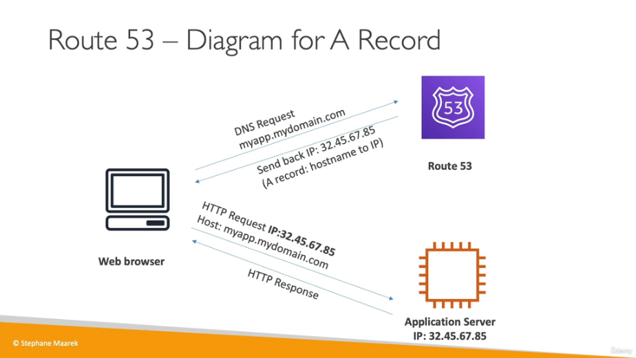
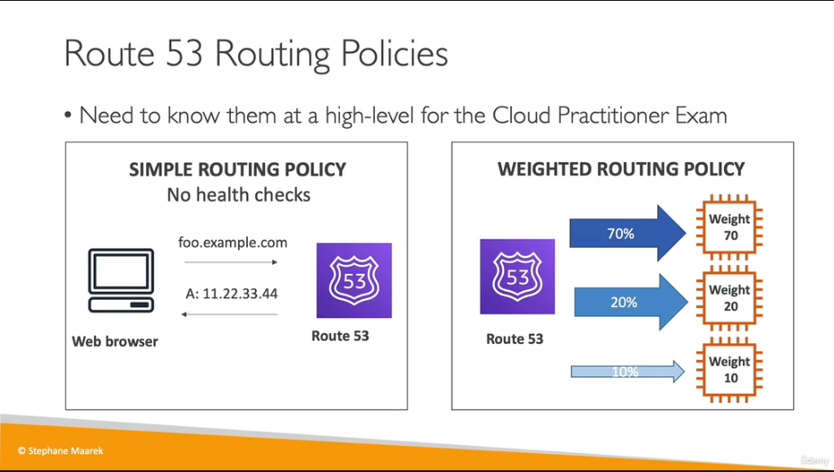

# Leveraging_AWS_Global_Infrastructure
## Why make a global application

A global application is set up in multiple regions and / or edge locations, The purpose is decreased latancy for the geographic regions covered as well as disaster recovery and protection from attacks.

Regions are geographic areas made up of multiple availability zones and these contain multiple points of presence (edge locations).

## Route 53

Helps to route users to the closest deployment with the least latency and is great for disaster recovery stratergies. It is a managed DNS.

IPv4 address is called a A record
IPv6 address is called a AAAA record
hostname is called a CNAME
hostname into an AWS resource is called an Alias record



### Simple and Weighted Routing Policy



### Latency Routing Policy

Route 53 will locate servers closer to users for reduced latency

## Route 53 Hands on

go to `route53>dormains>registered dormains` and search for an available dormain name, This will take 10minutes to become available which can now be find in `hosted zones`. This should now show your DNS records.

go to `EC2 console` and launch a new instance , this can be set up as normall so long as it allows HTTP traffic in the security groups.

A simple script can be added in user data to show a string on the webpage such as 

```
#!/bin/bash
# Use this for your user data (script from top to bottom)
# install httpd (Linux 2 version)
yum update -y
yum install -y httpd
systemctl start httpd
systemctl enable httpd
echo "<h1>Hello World from $(hostname -f)</h1>/var/www/html/index.html
```

