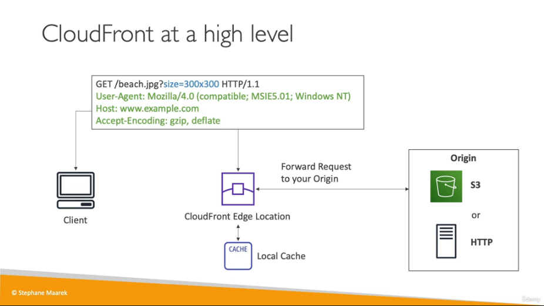
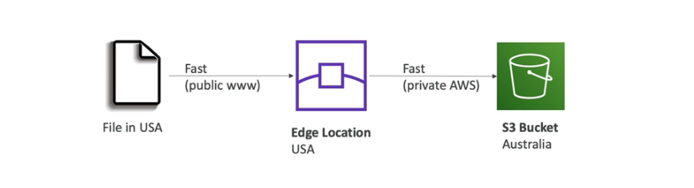
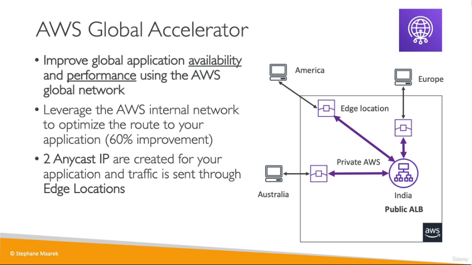
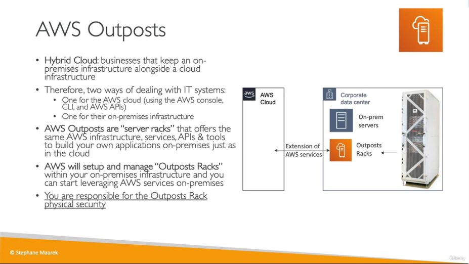
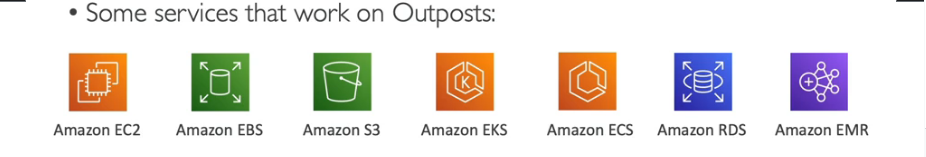
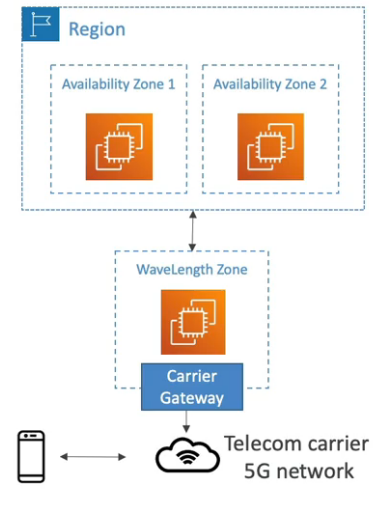
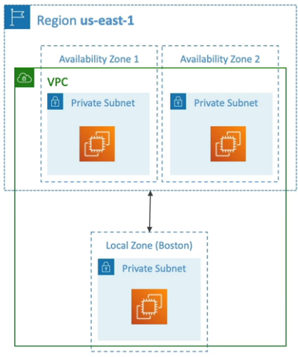
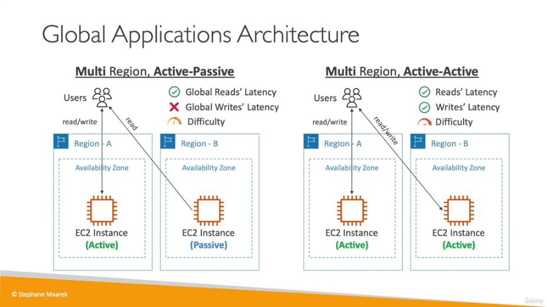

# Leveraging_AWS_Global_Infrastructure
## Why make a global application

A global application is set up in multiple regions and / or edge locations, The purpose is decreased latancy for the geographic regions covered as well as disaster recovery and protection from attacks.

Regions are geographic areas made up of multiple availability zones and these contain multiple points of presence (edge locations).

## Route 53

Helps to route users to the closest deployment with the least latency and is great for disaster recovery stratergies. It is a managed DNS.

IPv4 address is called a A record
IPv6 address is called a AAAA record
hostname is called a CNAME
hostname into an AWS resource is called an Alias record


### Simple and Weighted Routing Policy


### Latency Routing Policy

Route 53 will locate servers closer to users for reduced latency

## Route 53 Hands on

go to `route53>dormains>registered dormains` and search for an available dormain name, This will take 10minutes to become available which can now be find in `hosted zones`. This should now show your DNS records.

go to `EC2 console` and launch a new instance , this can be set up as normall so long as it allows HTTP traffic in the security groups.

A simple script can be added in user data to show a string on the webpage such as 

```
#!/bin/bash
# Use this for your user data (script from top to bottom)
# install httpd (Linux 2 version)
yum update -y
yum install -y httpd
systemctl start httpd
systemctl enable httpd
echo "<h1>Hello World from insert region here$(hostname -f)</h1>/var/www/html/index.html
```

save the public ip and the availability zone, then start another instance in a different availability zone using the same data and settings.

Navigate back to route 53 and create your first record with www as the record name (infront of your dormain name). Use A for traffic type and place the ip address in the Value. The routing policy is going to be a Latency policy. Place a suitable Record ID , such as my instance from x.

In record 2 place the other ip address from the second instance , change the region to the second instance region.

In hosted zones check the records.

you can now check the website in the browser , use a vpn for different regions.

## AWS CloudFront

This is a Content Delivery Network (CDN), it improves read performance as content is cached in edge locations. It also has DDoS protection , integration with shield and AWS Web Application Firewall. CloudFront Origins can be S3 Buckets or Custom Origin HTTP backend.




Cloudfront is great for static content that must be available everywhere, S3 is great for dynamic content tha needs to be available at low latency in few regions.

## CloudFront Hands On

create a new s3bucket with default settings and upload, then you can add files to the bucket. click on open and you will see the html but not any images that you uploaded, since they are not public. cloudfront can be used to overcome this.

Then a distribution must be created, an origin dormanin can be used that was saved before, the s3 bucket and origin access control settings can be used. this can be created and use the default settings. You must select the default root object as your html file.

This can now be created and the policy can be copied using the button then , click on the shortcut to the s3 bucket policy.

Edit the bucket policy and paste the copied policy.

Once this is deployed it can be accessed using the url.

## S3 Transfer Acceleration

Increase the speed by transferring files to an AWS edge location which will forward the data to the S3 bucket in the target region.



## AWS Global Accelerator



Global accelerator is similar to Cloudfront however , content in cloudfront is served at the edge and it improves performance of cacheable content. Global accelerator has no caching , it improves performance for a wide range of applications over TCP or UDP, it proxys packets at edge to applications running in one or more AWS Regions. It is good for HTTP use cases that require static IP addresses or deterministic, fast regional failover.

## AWS Outposts



The benefits of AWS outposts are
- Low-latency access to on premises systems
- Local data processing
- Data residency
- Easier migration from on-premesis to the cloud
- Fully managed service



## AWS Wavelength

Wavelength are infrastructure deployments embedded within the telecommunications providers' datacenters at the edge of the 5G networks for ultra low latency 5G networks.



## AWS Local Zones



These can be found in your instance , settings, zones , you can enable local zones in some places.

## Global Applications Architecture

single region, single az does not give is good availability or latency. 

