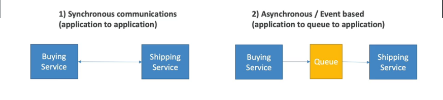
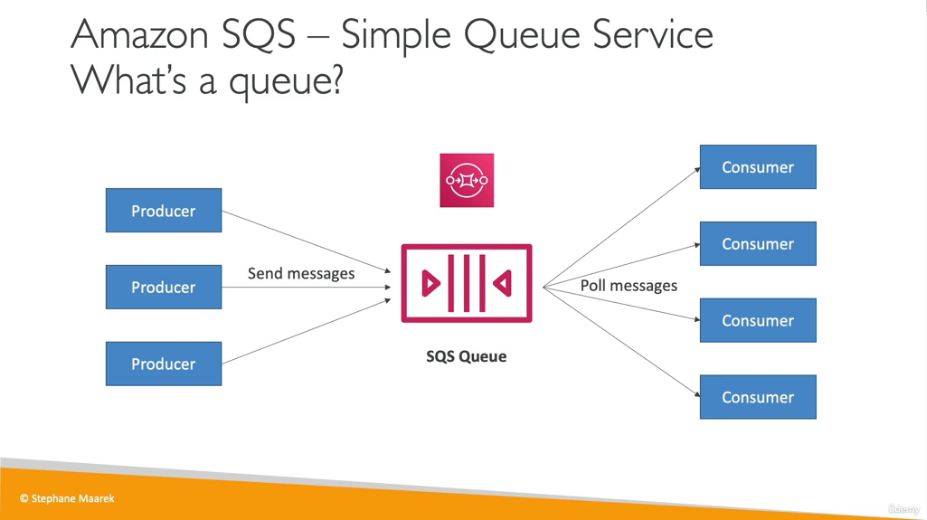
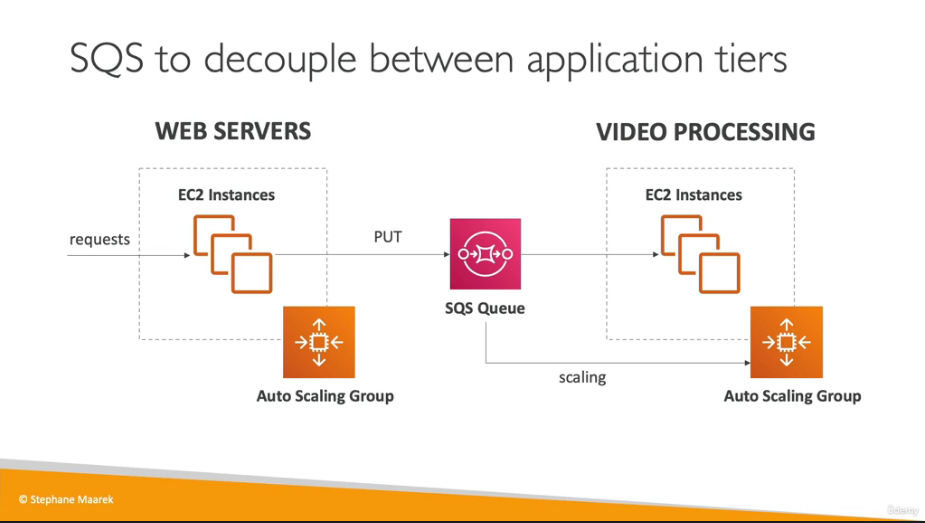

# Cloud_Integrations

## Introduction
When we deploy in multiple applications, services have to communicate with one another.

You can decouple your applications using SQS , SNS or Kinesis. These services can scale independantly from our application.

## AWS SQS

This is a simple queue service. They can be used to dcouple between application tiers. It is a fully managed , serverless service and there are is no limit on how many messages can be in the queue.

Example using autoscaling groups

