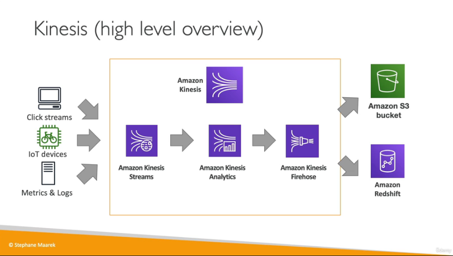

# Cloud_Integrations

## Introduction
When we deploy in multiple applications, services have to communicate with one another.

You can decouple your applications using SQS , SNS or Kinesis. These services can scale independantly from our application.

## AWS SQS

This is a simple queue service. They can be used to dcouple between application tiers. It is a fully managed , serverless service and there are is no limit on how many messages can be in the queue.

Example using autoscaling groups

## SQS Hands on

You can navigate to Amazon SQS and click on create queue. The options can be left on default and the queue created.

once the queue is created you can click on send and recieve messages. You can now click on poll messages and view the messages.

## Amazon Kinesis

Kenisis is real-time big data streaming
managed service to collect, process and analyze real-time streaming data at any scale
Kinesis Data Streams, Kinesis Data Firehose and Kinesis Data Analytics are subservices of Kinesis.

## Amazon SNS

What if you want to send one message to many recievers ? Data can be sent to sqs, email, sms , lambda ,kenisis and HTTP(s) endpoints.

## SNS Hands On

navigate to sns and create a topic , leaving all the options on default with an appropiate name. You can now create a subscription. We can use email as the end point and use a personal email. You can now confirm your subscription by email. A message can be published and sent to this email.

## Amazon MQ

SQS, SNS are "cloud-native" services. This is a managed message broker for migrations.