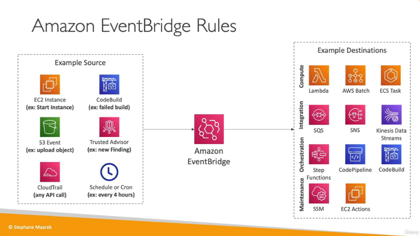
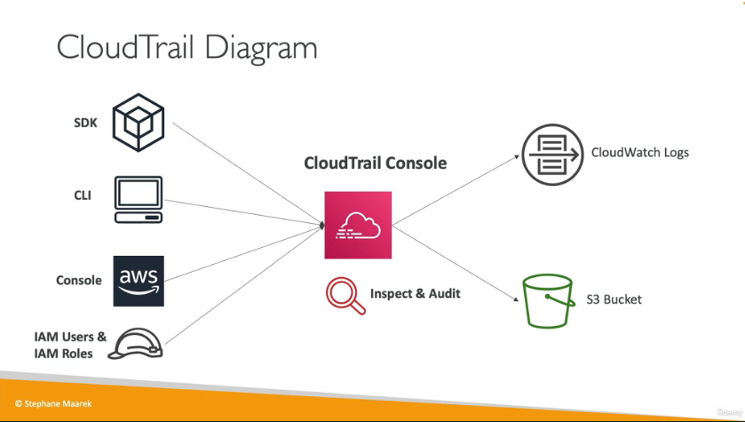
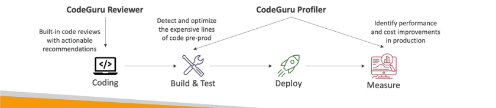

# Cloud Monitoring

## CloudWatch Metrics and Cloudwatch alarms
provides metrics for every service in aws with timespamps. Billing for example which is only present in us-east-1. In EC2 , CPU utilization , Status Checks and Network . By default metrics are transmitted every 5 minutes , less time is more expensive. There is also the option for custom metrics.

Cloudwatch alarms allow autoscaling , EC2 actions and SNS notifications to  be carried out automatically.

## Cloudwatch Metrics and Alarms Hands On

navigate to `CloudWatch>Alarms>Create Alarm` . You can use your own email in step 2 configure options by creating the topic.

Alternatively the alarm can be created from the EC2 instance in the monitoring tab, the EC2 instance will have an alarm status where another alarm can be created .

## CloudWatch Logs Overview

Collects log data for all the different services. Can have logs for a selected amount of time. Must create cloudwatch logs agent. There must be the correct IAM permissions. This is a hybrid agent that works both on prem and cloud.

## CloudWatch Log Groups

navigate to `CloudWatch>Log Groups`. Lambda may already have a log group here , this can be tested by changing the code in Lambda.

## Amazon EventBridge

This can be used to schedule cron jobs. These are scheduled scripts on Lambda functions but also many other services.

## Amazon Eventbridge Hands On

navigate to Amazon Eventbridge and create a rule. This can be made into a recurring rate-based schedule in step 1. This can be invoked every hour with flexible time being off. The lambda function can be selected on the next page and the rule can be created.

A schedule must now be made to invoke this rule.

## CloudTrail Overview

Provides governence, compliance and audit for your AWS Account. A trail can be applied to all regions or a single region. If a resource is deleted , investigate cloudtrail.

## CloudTrail Hands on

navigate to `cloudtrail>Event history`

## AWS X-Ray

for full performance trouble shooting and understanding depencies in a microservice architecture

## CodeGuru Overview

This is an ML-powered service for automated code reviews and application performance recommendations.

This has two functionalities , reviewer and profiler.

## AWS Health Dashboard

## AWS Health Dashboard Hands On

Navigate to AWS Health Dashboard and click on service history. Here you can see the recent issues. The event log tab will also show operational issues.