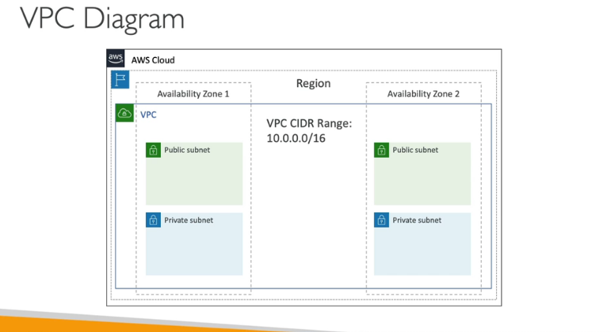
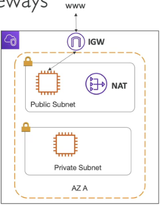
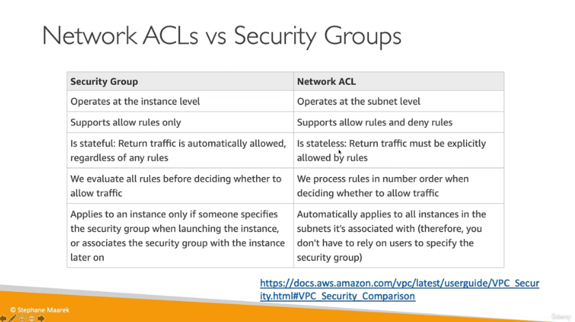
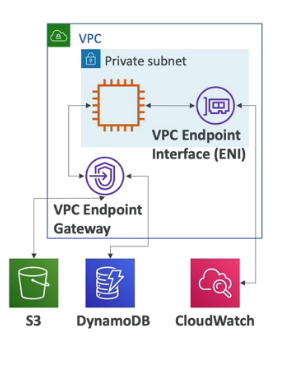
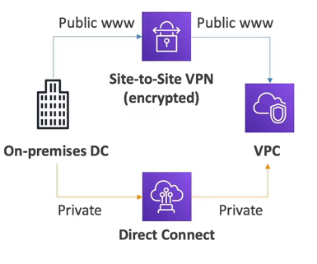
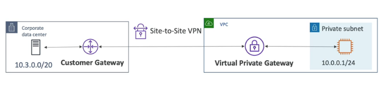
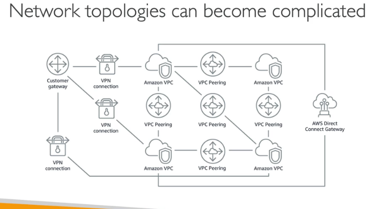

# VPC and Networking

## IP Addresses in AWS

IPv4 is Internet Protocol version 4, Private IPv4 can be used inside your own network and is constant
Elastic IP allows you to creae a fixed IPv4 address which can be attached to your EC2 instance. There will be an ongoing cost if you keep the elastic IP unattached to EC2.
IPv6 is another IP type which is public (no private range)

## VPC, Subnet, Internet Gateway & NAT Gateways

VPC is the virtual private cloud, subnets allow you to partition the network inside the VPC with both public and private subnets, to define access route tables are used.

The internet gateway lets our VPC connect to the internet. NAT gateways and NAT instances allow your instances in your private subnets to access the internet.

## Security Groups & Network Access Control List

The NACL is a firewall that controls traffic to and from the subnet. Can have ALLOW and DENY rules. These are attached at the subnet level.

Security Groups have ALLOW rules, controls the firewall to and from the EC2 instance.

## VPC flow logs and VPC peering

Flow logs capture information about IP traffic going into your interfaces.

VPC Peering can connect privately using AWS network. Must not have overlapping CIDR

## VPC Endpoints - Interface and Gateway (S3 & DynamoDB)

Endpoints alow you to connect to AWS Services using a private network instead of www network. This gives enhanced security and lower latency access AWS services.

## AWS Privatelink

the most secure and scalable way to expose a service to 1000s of VPCs. This does not allow VPC peering , internet gateway, NAT or route tables

## Direct Connect & Site to Site VPN

Connect an on prem VPN to AWS, the connection is automatically encrypted. Goes over public internet with Site to site VPN.

Direct Connect (DX)
Establish physical connection between on premesis and AWS. The connection is private, secure and fast and goes over a private network. Takes a month to establish.

A site to site vpn workes using a customer gateway and virtual private gateway.

## AWS Client VPN

Connect to your computer using OpenVPN to your private network in AWS and on-premesis

Allow you to connect to your EC2 instances over a private IP, just as if you were in the private VPC network.

This goes over public internet.

## Transit Gateway
