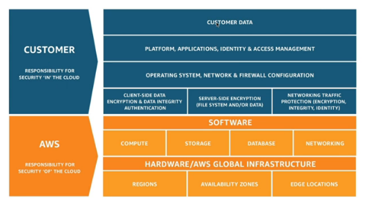
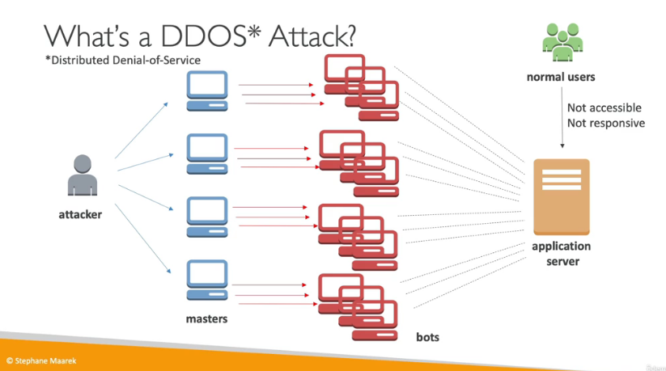
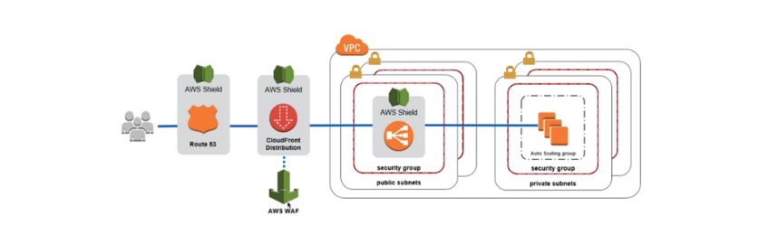

# Security and Compliance

## Shared Responsibility Model: Reminders and Examples

AWS responsibility is the security of the cloud and protecting infrastructure as well as managed services like S3

Your responisibility include the management of guest OS , firewall and network configuration, IAM.

For example in RDS, AWS is responsible for Automated Patching, manageing the underlying EC2 instance and Audit the underlying instance while he customer is responsible for the Ports and security groups, permissions, creating the database with or without public access and ensure the parameter groups only allow SSL connections.

## DDOS Protection WAF & Shield

DDOS is distributed denial of service attack.

Shield Standard protects against DDOS attack for all customers at no additional costs. can protect against SYN/UDP Floods, reflection attacks and other layer 3/ layer 4 attacks.
Shield Advanced is optional DDoS protection for $3000 per month.
AWS WAF is Web application Firewall which protects web applications from common web exploits up to layer 7 which is HTTP , layer 4 is TCP. 
CloudFront and Route 53 can also help here , be ready to use autoscaling.

Sample Reference Architecture

## Penetration Testing

Can be used for 8 services without prior approval including EC2 and RDS. Prohibited activities inculde DNS zone walking via Amazon Route 53 hosted zones, denial of service (DoS), Distributed Denial of Service (DDoS) and the simulated variaties. Cannot do Port flooding or protocol flooding and request flooding.

