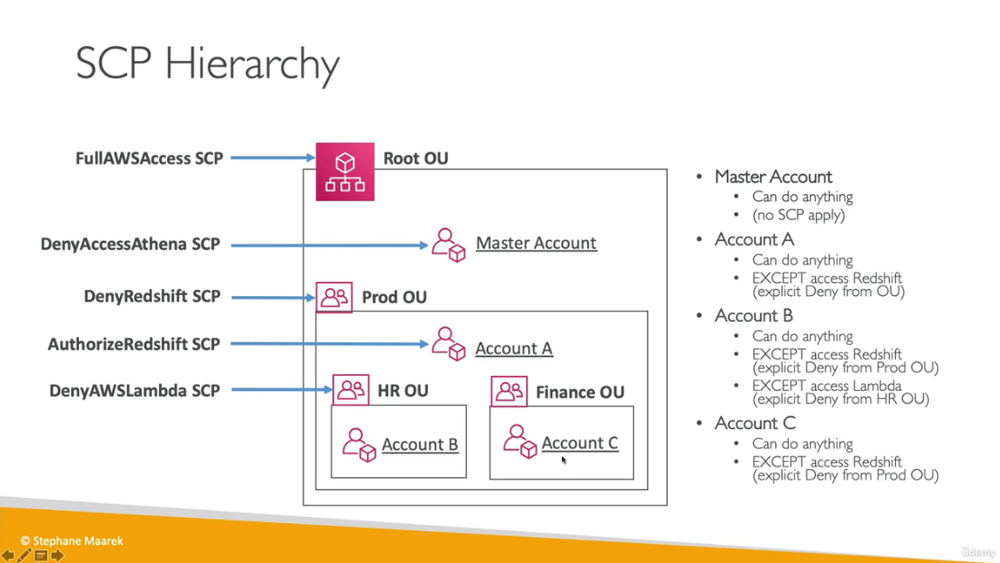
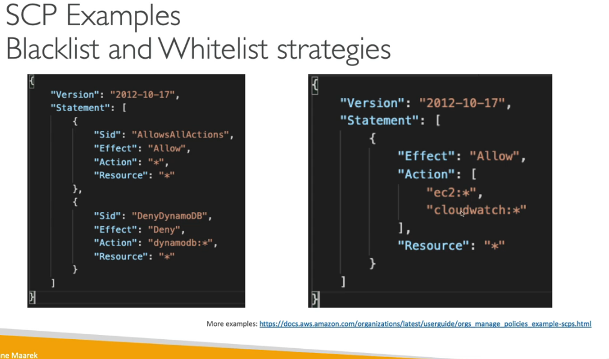
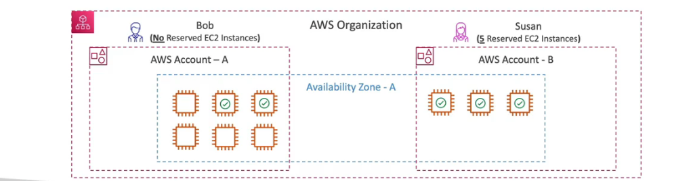
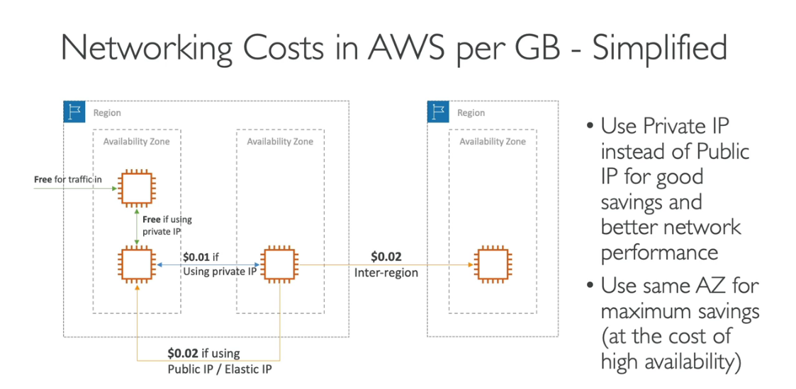
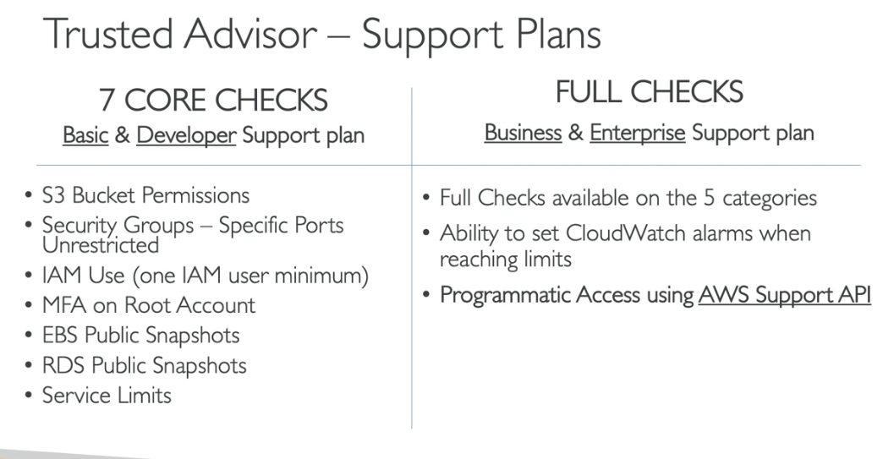

# Acount Management, Billing and support.

## AWS organisations

Global service for manageing multiple aws accounts. The main account is the master account. This can consolidate billing across accounts with pricing benefits.

## Multi Account strategies

Create accounts per department per cost center etc

## Service Control Policies (SCP)

Whitelist or blacklist IAM actions, Does not apply to the master account. SCP is applied to all users and roles of the account, including Root. Must have explicit allow.

## Organisations Hands On.

Create two new accounts on aws, one master and one child . Within the master you can create an organisation. 

From here an account can either be created , or it can be named with the account id and email.

Organisational units can be made within departments attached to the root folder.

## Organisations Consolidated Billing

This enables us to have combined usage pricing and a single bill.

## AWS Control Tower

An easy way to govern a secure and compliant multi-account AWS environment. 

You can fill in a Master account, Log archieve account and Audit Account.

## AWS Service Catalog

Admins can create Cloudformation templates and then a portfolio of products with IAM Permissions. Now users will only have access to Authorized products.

## Pricing Models in AWS

There are four pricing models, Pay as you go, Save when you reserve, Pay less by using more and pay less as AWS grows.

### Free serivices and free tier in AWS

- IAM
- VPC
- Consolidated Biling
- Elastic Beanstalk
- CloudFormation
- Auto Scaling Groups
- EC2 t2.micro instance for a year
- S3, EBS, ELB, AWS Data transfer

Reserved instances have up to 75% discount for 1 to 3 year commitments. All upfront , partial upfront or no upfront.

Spot discount is up to 90% discount where bids are made for unused capacity.

Savings plans as an alternative.

The price can be tiered for S3 (based on volume). Sending data into S3 is free but out comes at a cost.

## Savings Plan

Commit to usage of individual instance families in a region (eg C5 or M5). Regardless of AZ, size (m5.xl to m5.4xl), OS (Linux/Windows) or tenancy

Compute savings plan has up to 66% discount regardless of family , region, size , OS, tenancy or compute options.

Machine learning Savings plan includes sagemaker.

## AWS Compute Optimizer

To Reduce costs and improve performance for workloads. Uses machine learning to analyze your resources' configurations and their utilization CloudWatch metrics.

lower costs by up to 25%

## Billing and Costing tools

### Estimating costs in the cloud
- Pricing Calculator

### Tracking costs in the cloud
- Billing Dashboard
- Cost Allocation Tags
- Cost and Usage Reports
- Cost Explorer

### Monitoring against costs plans
- Billing Alarms
- Budgets

## Estimating costs on the cloud - Pricing calculator

You can use the pricing calculator to calculate costs and add to estimated costs.

You can check the cost of instances and also load balancers and other services here.

## Tracking Costs in the cloud

You can accesses Resource Groups and cost allocation tags to Track your costs. This is the most comprehensive set of AWS cost and usage data available. This report can be integrated and analysed using athena , redshift or quicksight. Cost Explorer can visualise , understand and manage AWS costs and usage over time.

### Estimating Costs on the cloud
- TCO calculator
- Simple Monthly Calculator / Pricing Calculator
### Tracking costs in the cloud
- Billing Dashboard
- Cost Allocation Tags
- Cost and Usage Reports
- Cost Explorer

## Monitoring costs in the cloud

This will show the fixed and monthly budgets as well as the ability to plan and set budgets.

## AWS Cost anomaly Detection

Uses machine learning to continually monitor and detect unusual spending. Sends anomaly detection report with root-cause analysis.

## AWS Service Quotas

Notify you when youre close to a service quota value threshold. This allows for alarms from cloudwatch alarms.

## Trusted advisor service

## Support Plans for AWS

For trusted advisor - full set of checks + API access . 24x7 chat access to cloud support engineers. Access to infrastructure management for an additional fee.

- General guidance <24 business hours
- System impaired <12 business hours
- Production system impaired < 4 hours
- Production system down < 1 hour

### Enterprise Support plan

All of the prior benefits along with event management , architected and operations reviews. Access to designated technical account manager and concierge support team.
- business critical system down <15 minutes

## Account best pracitices

- Operate mulitple accounts using organisations
- Use SCP to restrict account power
- Easily setup multiple accounts with best practices with AWS Control tower
- Use Tags for easy management and billing
- IAM guidelines , MFA, least-privalege, password policy, password rotation.
- Config to record configurations and compliance
- Trusted Advisor to get insights , support plan
- Send service logs and Access logs to S3 or Cloudwatch logs
- CloudTrail to record API calls made within your account
- Allow users to create pre defined stacks defined by admins in AWS service catalog
- if Account compromised, change root password, delete and rotate all passwords / keys and contact AWS support.

## billing and Costing Tools

- Compute Optimizer
- Pricing Calculator
- Billing Dashboard
- Cost Allocation Tags
- Cost and Usage Reports
- Cost Explorer
- Billing Alarms
- Budgets
- Savings Plans