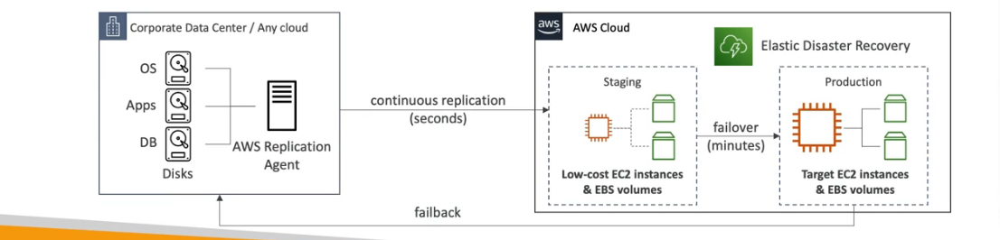
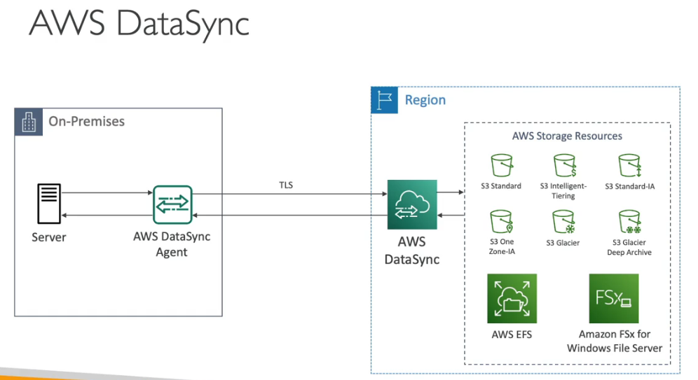

# Amazon Workspaces

## WorkSpaces Overview

Managed Desktop as a Service (DaaS) solution to easily provision Windows or Linux Desktop. Elimination of on premise infrastructure. Fast and quickly scalable to thousands of users. Secured data -integrates with KMS. Pay as you go with monthly or hourly rates.

## Appstream 2.0 Overview

Desktop Application Streaming Service. Deliver to any computer, without aquiring , provisioning infrastructure. The application is delivered through your web browser.

### Workspaces

fully managed VDI and desktop available. The users connect to the VDI and open native or WAM applications. Workspaces are on demand or always on.

### AppStream 2.0

Stream a desktop aplication to web browsers (no need to connect a VDI). Works with any device (that has a web browser)

## IoT Core Overview

Internet of things are a network of internet connected devices that are able to collect and transfer data.

IoT core allows you to easily connect to IoT devices on the cloud.

Your applications can comminucate even where they are not connected.

## Amazon Elastic Transcoder

Elastic Transcoder is used to convert media files stored in S3 to formats required by consumer playback devices.

It is easy to use , highly scalable and cost effective.

## AppSync

Make use of GraphQL (mobile technology from facebook). Client code can be generated automatically. Integrations with DynamoDB / Lambda and Real time subscriptions. Offline data synchronization and fine grain security . Amplify can leverage Appsync in background.

## Amplify

Set of tools and services for development and deployment. full stack web adn mobile applications.

Authentication, storage , API , CI/CD, PubSub, Analytics, AI/ML Predictions, Monitoring, Source Code from AWS, Github etc...

## Device Farm

Fully managed services that tests your web and mobile apps against desktop browsers , real mobile devieces and tablets. Run tests concurrently on multiple devices

## AWS Backup

Fully managed service to centrally manage and automate backups across AWS services.

## Disaster Recovery Strategies

Backup and restore has low cost and helps back up a corporate data center.

Pilot light backs up core functions of the app and is reeady to scale but minimal set up , it is slightly more expensive.

Warm standby hase core functions of the app at minimum size with further cost.

Multi site and hot site has high cost and is the full version of the app

## Elastic Disaster Recovery (DRS)

Quickly and easily recover your physical , virtual and cloud based servers into AWS with continuous block level replication. Can protect most critical databases.

## AWS DataSync

