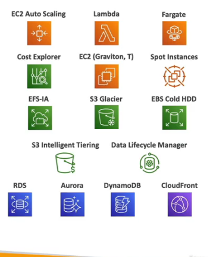

# Architecting & Ecosystem

## Well Architecting Framework General Principles

Stop guessing your capacity needs and test systems at a production scale. Automate to make architectural experimentation easier. Allow for evolutionary architectures. Drive architectures using data. Improve through game days (simulate flash demand).

- Scalability
- Disposable Resources
- Automation
- Loose Coupling
- Services not servers

### 6 pillars

- Operational Excellence
- Security
- Reliability
- Performance Efficiency
- Cost Optimisation
- Sustainability

## Operational Excelence

Include the ability to run and monitor systems to deliver business value and to coninually improve supporting processes and procedures

Design Principles
- Perform operations as code
- Annotate documentation
- Make frequent , small , reversable changes.
- Refine operations procedures frequently
- Anticipate failure
- Learn from all operational failures

prepare with CloudFormation and AWS Config and Operate with them as well as Cloudtrail , CloudWatch and X-Ray.

Finally Evolve with Codebuild,CodeCommit, CodeDeploy and CodePipeline.

## Security

The ability to protect information, systems and assets while delivering business value.

### Design Principles

- Implement a strong identity foundation
- Enable Traceability
- Apply security at all layers
- Automate security best practices
- keep people away from data
- Prepare for security events

### Services

IAM, IAM, AWS-STS, MFA token, AWS Organizations
Detective Controls, AWS Config, AWS CloudTrail, Cloudwatch
Infrastructure Protection, CloudFront, VPC, Shield, WAF, Inspector
Data Protection, KMS, S3, ELB, EBS, RDS
Incident Response, IAM, CloudFormation, CloudWatch EVents

## Reliability
The ability of a system to recover from disruptions and aquire resources to meet demand.

- Test recovery procedures
- Automatically recover from failure
- Scale horizontally to increase aggregate system availability
- Stop guessing capacity
- Manage change in automation

### Reliability Services

Foundations - IAM, VPC, Service Limits, Trusted Advisor
Change Management - Auto Scaling , cloudWatch, CloudTrail, Config
Failure Management - Backups, CloudFormation, S3, S3 Glacier, Route 53

## Performance Efficiency

Includes the ability to use computing resources efficiently to meet system requirements

### Design Principles
- Democratise advanced technologies
- Go global in minutes
- Use serverless architectures
- Experiment more often
- Mechanical symphathy

### Efficiency
Selection - AutoScaling , Lambda, EBS, S3, RDS,
Review - CloudFormation, AWS News Blog
Monitoring - CloudWatch, Lambda, 
Tradeoffs - RDS, ElastiCache, Snowball, CloudFront

## Cost Optimization
Includes the ability to run systems to deliver business value at the lowest price point.

### Design Principles
- Adopt a consumption mode
- Measure overall efficiency
- Stop spending money on data center operations
- Analyze and attribute expenditure
- Use managed application level services to reduce ownership costs

### Optimisation Services
Expenditure awareness AWS Budgets, Cost and usage reports, Cost explorer, Instance reporting
Cost Effective Resources , spot instance, Reserve instance, S3 Glacier
Matching supply and demand - Auto Scaling, Lamda
Optimizing over time - Trusted advisor , Usage report.

## Sustainability
The sustainability pillar focuses on minimizing the environmental impacts of running cloud workloads

### Design Principles
- Understand your impact
- Establish sustainability goals
- Maximise Utilisation
- Anticipate and adopt new more efficient hardware and software offerings
- Use managed services
- Reduce the downstream impact of your cloud workloads

### Services

## AWS Well-Architected Tool

you can define a workload here including environment (production) and region. lenses can be applied.

## Right Sizing

EC2 has many instance types. Right sizing matches instance types and sizes workload performance and capacity requirements at the lowest possible cost. Scaling up is easy so always star small. It is also the process of looking at deployed instances and identifying opportunities to eliminate or downsize without compromising capacity or other requirements.