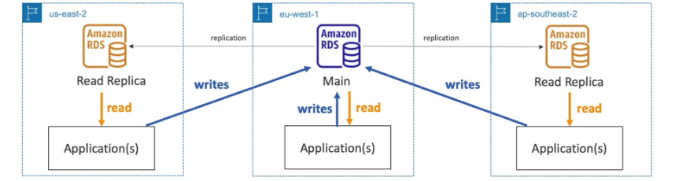
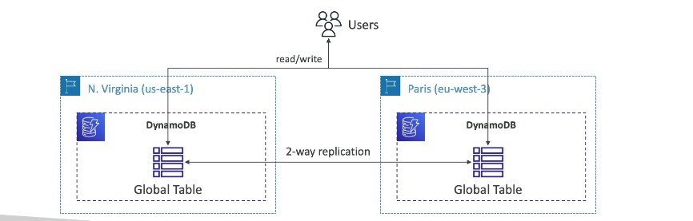
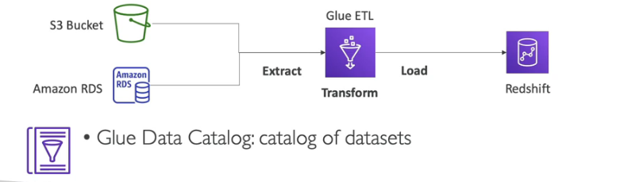

# Databases and Analytics

## Databases Introduction

Looks like Excel spreadsheet. with links between databases. For example department ID could be on multiple databases and have links between them , enables SQL to query.

NoSQL databases are non relational , more flexibility and scalable. Benefits include high performance and functionality. Can have database in JSON. This means data can be nested and fields change over time.

AWS can manage databases and will be responsible for operating ystem patching , as well as other benefits such as monitoring , provisioning, backup , operations and upgrades.

When run on EC2 these databases are your responsibility.

## RDS and Aurora

Relational database service with SQL, which allows you to create databases in the cloud that are managed by AWS. You cannot SSH into instance.

- automated provisioning, OS patching
- Continuous backups and restore to specific timestamp
- Monitoring dashboards
- Read Replicas for improved read performance
- Multi AZ setup for DR
- Maintenence windows for upgrades
- Scaling capability (vertical or horizontal)
- Storage backed by EBS

###  Aurora

supports PostgreSQL and My SQL. this is cloud optimized and has much more performance than RDS. Aurora automatically grows in increments of 10GB. Aurora costs 20% more but is more fficient , its not in free tier.

## RDS Deployment options

Read Replics can be created, up to 15 and can scale the read workload of your DB. Data is only written to the main DB.

Multi AZ has high availability , can read and write from the same main RDS database and is a failover database. Data is only read or written to the main database.

### Multi Region

## Elasticache overview

ElastiCache is to get managed Redis or Memcached. Caches are in-memory databases with high performance and low latency. AWS takes care of maintenance , optimizations, setup , config, monitoring , failure recovery and backups.

## Dynamo DB

Fully managed, highly available with replication across 3 AZ. No SQL database - not a relational database. Scales to massive workloads, distributed serverless database. Millions of requests per seconds, trillions of rows, 100s or TB of storage. Single digit millisecond latency - low latency retrieval. Intigrated with IAM for security , authorisation and administration. Low cost and autoscaling. Standard & infrequent access (IA) table class.

## Dynamo Global tables

## Redshift

Redshift is based on PostgreSQL, but it is not used for OLTP. Load every hour not every second. 10x better performance than other data warehouses, scale to PBs of data. Columnar storage of data. Massively Parallel Query execution (MPP).Pay as you go on instances provisioned. Has SQL.

## EMR

Amazon Elastic Map Reduce , Helps to create Hadoop cluster (Big data) to analyze and process vast amount of data. the clusters can be made of hundreds of EC2 instances. Also supports Apache spark , HBase , Presto , Flink. EMR also provisions and configures with autoscaling.

## Athena

Serverless query sevice to perform analytics against S3 objects, uses SQL to query and supports CSV, JSON, ORC, Avro and Parquet (built on Presto) Pricing is $5 per TB. Use of compressed or columnar data for cost savings.

## Quicksight

Serverless machine learning-powered business intelligence service to create interactive dashboards.

Integrated with RDS, Aurora, Athena.

## DocumentDB Overview

Aurora is an "AWS-imlementation" of PostSQL / MySQL ... DocumentDB is the same for MongoDB (which is a NoSQL database). MongoDB is used to store , query and index JSON data.

Similar deployment concepts as Aurora, Fully managed with replication across 3 AZ. up to 64TB in increments of 10GB.

## Neptune

Fully managed graph database. For example a social network. Replication up to 15 read replicas in 3 AZ and are optimized for these complex and hard queries. Can store billions of relations and query the graph with milliseconds of latency.

## QLDB

Quantum ledger database. This is a book recording financial transactions, fully managed , serverless , high availability and replication across 3 AZ. Uset to review history of all the changes made to your application data over time, Immutable system.
2-3x better performancethan common ledger blockchain frameworks, manipulate data using SQL. Difference with Amazon Managed Blockchain.

## Managed Blockchain

Blockchain without the need for trusted , central authority. Amazon Blockchain is a managed service to : join public blockchain networks or creae your own scalable private netowrk. compatible with hyperledger fabric and ethereum

## Glue

Glue is a managed extract, transform and load service (ETL). Useful to prepare and transform data for analytics. Fully serverless service.

## DMS

Digital Migration Service,  quickly and securely migrate databases to AwS, resilient,

## Databases & Analytics Summary

- Relational Databases - OLTP: RDS & Aurora (SQL)
- Differences between  Multi-AZ, Read Replicas, Multi-Region
- In-memory Database: Elasticache
- Key/Value Database: DynamoDB (serverless) & DAX (cache for DynamoDB)
- Warehouse - OLAP:Redshift(SQL)
- Hadoop Cluster: EMR
- Athena: query data on Amazon S3 (serverless & SQL)
- QuickSight: dashboards on your data (serverless)
- DocumentDB "Aurora for MongoDB" (JSON - NoSQL databases)
- Amazon QLDB : Financial Transactions Ledger (immutable journal, cryptographically verifiable)
- Amazon Managed blockchain: managed Hyperledger Fabric & Ethereum blockchains
- Glue: Managed ETL (Extract Transform Load) and data catalog service
- Database Migration : DNS