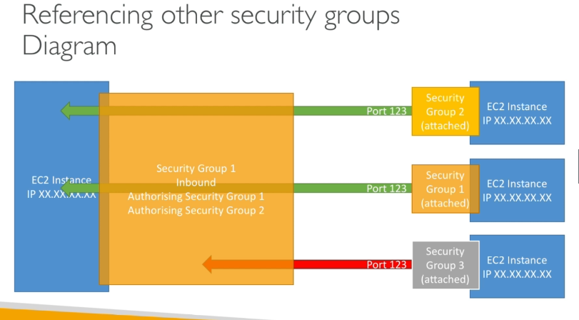

## EC2 Security Groups

application not accessable error (time out) is a security group issue

application gives "connection refused" error , then it's an application error

## Permission issues
right click on .pem file , go to properties, security, advanced. then change owner. remove system and administrator and disable inheritance access. add user for yourself and enter the principle name. press ok. It should now only be you with full permission.
